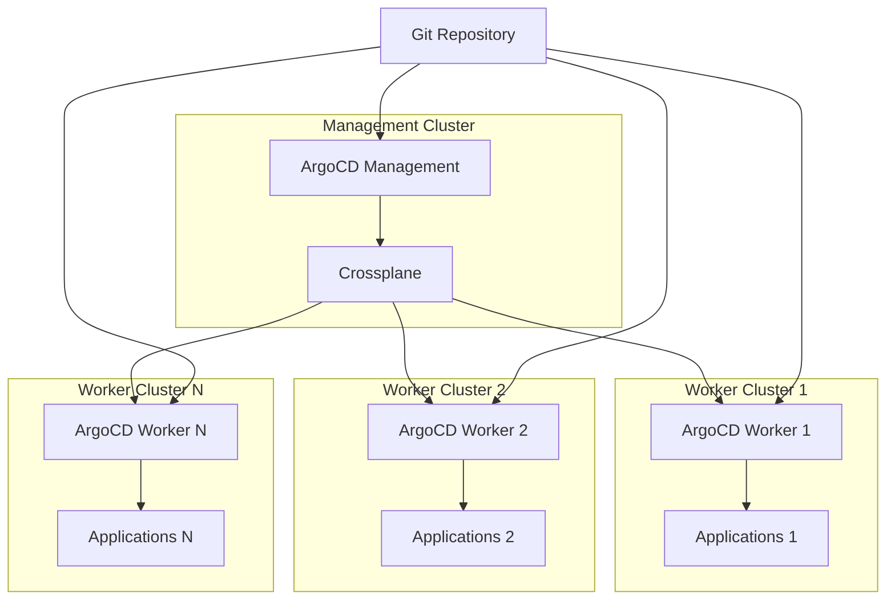
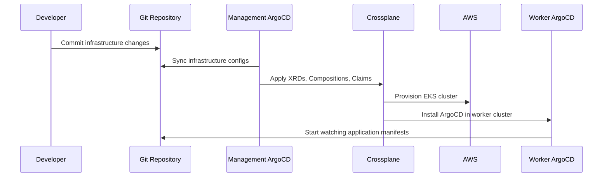
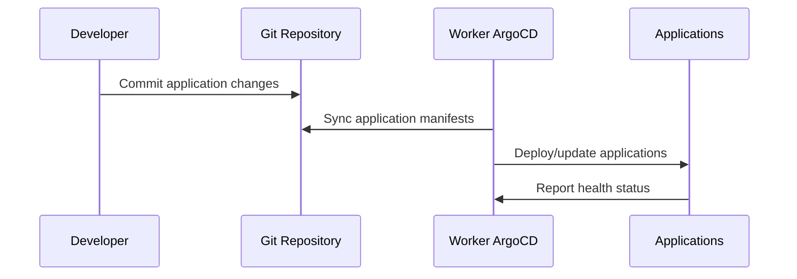

# ArgoCD Architecture: Scalable Multi-Cluster Pattern

## 🎯 **Correct Scalable Pattern Implemented**

You were absolutely right! The platform now implements the **scalable and robust pattern** where:

### **Management Cluster ArgoCD**
- **Responsibility**: Infrastructure provisioning and core services
- **Manages**: Crossplane XRDs, Compositions, and Claims
- **Provisions**: Worker clusters with their own ArgoCD instances
- **Does NOT manage**: Application deployments in worker clusters

### **Worker Cluster ArgoCD (Per Cluster)**
- **Responsibility**: Application deployment for that specific cluster
- **Automatically installed**: By Crossplane composition during cluster creation
- **Manages**: Applications, services, and workloads in its cluster
- **Isolated**: Each worker cluster has its own dedicated ArgoCD instance

## 🏗️ **Architecture Flow**



## 🔄 **Deployment Flow**

### **1. Infrastructure Changes**


### **2. Application Changes**


## 🛠️ **Implementation Details**

### **Crossplane Composition Enhancement**

The worker cluster composition now includes:

1. **Kubernetes Provider Config**: For managing Kubernetes resources in the worker cluster
2. **Helm Provider Config**: For installing Helm charts in the worker cluster
3. **ArgoCD Namespace**: Creates the argocd namespace
4. **ArgoCD Helm Release**: Installs ArgoCD via Helm chart
5. **ArgoCD Application**: Creates the application to manage worker cluster apps

### **Key Components Added**

```yaml
# In worker-cluster-composition.yaml

# 1. Kubernetes Provider Config
- name: kubernetes-provider-config
  base:
    apiVersion: kubernetes.crossplane.io/v1alpha1
    kind: ProviderConfig
    # ... configured to use worker cluster kubeconfig

# 2. Helm Provider Config  
- name: helm-provider-config
  base:
    apiVersion: helm.crossplane.io/v1beta1
    kind: ProviderConfig
    # ... configured to use worker cluster kubeconfig

# 3. ArgoCD Installation
- name: argocd-helm-release
  base:
    apiVersion: helm.crossplane.io/v1beta1
    kind: Release
    # ... installs ArgoCD in worker cluster

# 4. Application Management
- name: worker-apps-application
  base:
    apiVersion: kubernetes.crossplane.io/v1alpha1
    kind: Object
    # ... creates ArgoCD application for worker apps
```

## 🎯 **Benefits of This Pattern**

### **Scalability**
- ✅ **Independent scaling**: Each worker cluster manages its own applications
- ✅ **No bottlenecks**: Management ArgoCD doesn't handle application deployments
- ✅ **Isolated failures**: Issues in one worker cluster don't affect others

### **Security**
- ✅ **Least privilege**: Worker ArgoCD only has access to its own cluster
- ✅ **Isolation**: Applications can't access other clusters
- ✅ **Separate RBAC**: Each cluster has its own ArgoCD RBAC policies

### **Operational Excellence**
- ✅ **Clear separation**: Infrastructure vs application concerns
- ✅ **Independent operations**: Teams can manage applications independently
- ✅ **Easier troubleshooting**: Issues are isolated to specific clusters

### **Developer Experience**
- ✅ **Familiar workflow**: Same Git-based workflow for applications
- ✅ **Cluster-specific deployments**: Applications deployed to specific environments
- ✅ **Independent release cycles**: Each cluster can have different application versions

## 🔧 **Configuration**

### **Management Cluster ArgoCD Applications**

```yaml
# argocd/infrastructure/crossplane-xrds.yaml
apiVersion: argoproj.io/v1alpha1
kind: Application
metadata:
  name: crossplane-xrds
spec:
  source:
    path: crossplane/  # XRDs and base configurations
  # Manages infrastructure definitions

# argocd/infrastructure/worker-clusters.yaml  
apiVersion: argoproj.io/v1alpha1
kind: Application
metadata:
  name: worker-cluster-dev
spec:
  source:
    path: crossplane/claims/  # Worker cluster claims
  # Provisions worker clusters with ArgoCD
```

### **Worker Cluster ArgoCD Applications**

```yaml
# Automatically created by Crossplane composition
apiVersion: argoproj.io/v1alpha1
kind: Application
metadata:
  name: dev-applications  # Environment-specific
  namespace: argocd
spec:
  source:
    path: applications/k8s-manifests/  # Application manifests
  destination:
    server: https://kubernetes.default.svc  # Local cluster
  # Manages applications in this worker cluster
```

## 🚀 **Deployment Process**

### **1. Bootstrap Management Cluster**
```bash
cd terraform/
terraform apply
# Creates management cluster with ArgoCD and Crossplane
```

### **2. Infrastructure Provisioning**
```bash
# Management ArgoCD automatically:
# 1. Syncs Crossplane configurations from Git
# 2. Crossplane provisions worker clusters
# 3. Each worker cluster gets its own ArgoCD instance
# 4. Worker ArgoCD starts managing applications
```

### **3. Application Deployment**
```bash
# For each worker cluster:
# 1. Worker ArgoCD watches applications/k8s-manifests/
# 2. Automatically deploys applications to its cluster
# 3. Provides health status and sync information
```

## 📊 **Comparison: Before vs After**

| Aspect | Before (Centralized) | After (Distributed) |
|--------|---------------------|---------------------|
| **Scalability** | Limited by single ArgoCD | Scales with worker clusters |
| **Isolation** | All apps in one ArgoCD | Each cluster isolated |
| **Security** | Broad permissions needed | Least privilege per cluster |
| **Failure Impact** | Single point of failure | Isolated failures |
| **Operations** | Centralized bottleneck | Distributed operations |
| **Performance** | Degrades with scale | Consistent performance |

## 🎉 **Summary**

The platform now implements the **correct scalable pattern** where:

1. **Management ArgoCD**: Focuses solely on infrastructure provisioning
2. **Worker ArgoCD**: Dedicated instance per cluster for applications
3. **Automatic Installation**: Crossplane automatically installs ArgoCD in each worker cluster
4. **Isolated Operations**: Each cluster manages its own applications independently
5. **Scalable Architecture**: No bottlenecks or single points of failure

This pattern provides **enterprise-grade scalability** and follows **GitOps best practices** for multi-cluster environments! 🚀