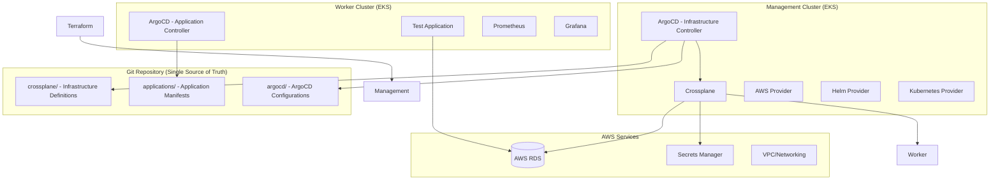
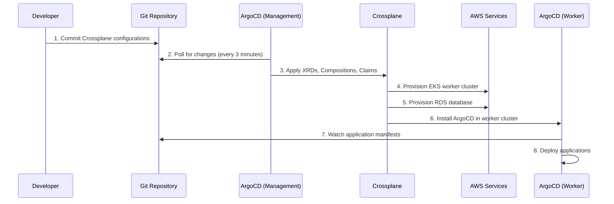
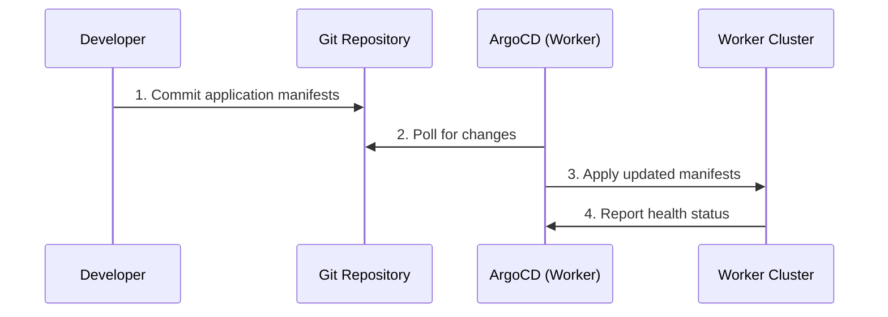

# GitOps Architecture Guide

## 🏗️ **Architecture Overview**

This platform implements a **unified GitOps architecture** where ArgoCD in the management cluster manages both infrastructure (via Crossplane) and applications, providing a single source of truth for all deployments.

### **High-Level Architecture**



## 🔄 **GitOps Flow**

### **Infrastructure Changes**


### **Application Changes**


## 📁 **Repository Structure**

```
crossplaneKubernetes/                    # Single source of truth
├── terraform/                          # Management cluster bootstrap
│   ├── main.tf                         # Main Terraform config
│   ├── eks.tf                          # EKS cluster
│   ├── argocd.tf                       # ArgoCD installation
│   ├── crossplane.tf                   # Crossplane installation
│   └── variables.tf                    # Configuration variables
├── crossplane/                         # 🎯 Infrastructure definitions
│   ├── xrd-worker-cluster.yaml         # ← ArgoCD syncs this
│   ├── xrd-database.yaml               # ← ArgoCD syncs this
│   ├── compositions/                   # ← ArgoCD syncs this
│   │   ├── worker-cluster-composition.yaml
│   │   ├── database-composition.yaml
│   │   └── argocd-composition.yaml
│   └── claims/                         # ← ArgoCD syncs this
│       ├── dev-cluster-claim.yaml
│       ├── staging-cluster-claim.yaml
│       └── prod-cluster-claim.yaml
├── argocd/                             # ArgoCD configurations
│   ├── infrastructure/                 # Infrastructure ArgoCD apps
│   │   ├── crossplane-xrds.yaml        # Manages crossplane/
│   │   └── worker-clusters.yaml        # Manages crossplane/claims/
│   ├── applications/                   # Application ArgoCD apps
│   └── projects/                       # ArgoCD projects
├── applications/                       # 🎯 Application manifests
│   └── k8s-manifests/                  # ← ArgoCD (worker) syncs this
│       ├── namespace.yaml
│       ├── deployment.yaml
│       ├── service.yaml
│       └── ingress.yaml
└── scripts/                            # Deployment scripts
    └── deploy-all.sh                   # Complete deployment
```

## 🚀 **Deployment Process**

### **1. Bootstrap Management Cluster**
```bash
# Deploy management cluster with Terraform
cd terraform/
terraform init
terraform plan
terraform apply

# This creates:
# ✓ EKS management cluster
# ✓ ArgoCD installation
# ✓ Crossplane installation
# ✓ AWS providers
# ✓ IAM roles and policies
```

### **2. Configure GitOps**
```bash
# ArgoCD automatically starts watching Git repository
# and applies infrastructure configurations

# Check ArgoCD applications
kubectl get applications -n argocd

# Applications created:
# ✓ crossplane-xrds (manages XRDs)
# ✓ crossplane-compositions (manages Compositions)
# ✓ worker-cluster-dev (manages dev cluster)
# ✓ worker-cluster-staging (manages staging cluster)
# ✓ worker-cluster-prod (manages prod cluster)
```

### **3. Infrastructure Provisioning**
```bash
# ArgoCD applies Crossplane configurations
# Crossplane provisions AWS resources

# Monitor infrastructure creation
kubectl get workerclusters
kubectl describe workercluster dev-cluster

# Resources created:
# ✓ EKS worker clusters
# ✓ VPC and networking
# ✓ RDS databases
# ✓ ArgoCD in worker clusters
```

### **4. Application Deployment**
```bash
# ArgoCD in worker clusters deploys applications
# from applications/k8s-manifests/

# Check application status
kubectl get pods -n test-app
kubectl get applications -n argocd
```

## 🎉 **Summary**

This GitOps architecture provides:
- **Unified control** through ArgoCD
- **Declarative infrastructure** with Crossplane
- **Automated deployments** via Git commits
- **Scalable multi-environment** support
- **Security by default** with AWS best practices

The platform automatically provisions and manages infrastructure while providing a seamless developer experience for application deployments! 🚀