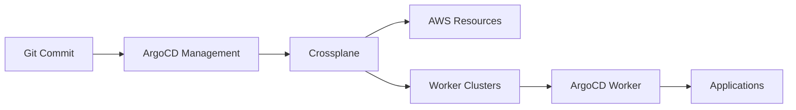

# Crossplane Kubernetes Automation with Unified GitOps

This project implements a **fully automated Kubernetes platform** using **Terraform** for bootstrapping, **Crossplane** for infrastructure provisioning, and **ArgoCD** for unified GitOps control of both infrastructure and applications.

## 🎯 **Key Innovation: Unified GitOps Architecture**

**ArgoCD in the management cluster manages everything:**
- 🏗️ **Infrastructure**: Crossplane XRDs, Compositions, and Claims
- 🚀 **Worker Clusters**: EKS clusters, RDS databases, networking
- 📱 **Applications**: Deployed across multiple worker clusters via GitOps
- 🔧 **Platform Services**: Monitoring, logging, security

## 🏛️ **Architecture Overview**

- **Management Cluster**: EKS cluster with ArgoCD and Crossplane for unified GitOps control
- **Worker Clusters**: Declaratively created by Crossplane, with ArgoCD for application deployment
- **Database**: AWS RDS provisioned by Crossplane for application data persistence
- **Single Repository**: All infrastructure and applications defined in one Git repository

### **GitOps Flow**



**Management Cluster** → **Worker Clusters** → **Applications**
- Management ArgoCD watches Git for infrastructure changes
- Crossplane provisions AWS resources and worker clusters
- Worker ArgoCD deploys applications from the same Git repository

## 📋 **Prerequisites**

- AWS CLI configured with appropriate permissions
- Terraform >= 1.0
- kubectl
- Helm >= 3.0
- Git

## 🚀 **Quick Start**

### **1. Setup Repository**
```bash
# Configure repository URLs
./scripts/setup-repository.sh
# Follow prompts to enter your GitHub username and repository name
```

### **2. Configure Platform**
```bash
cd terraform/
# Edit terraform.tfvars with your specific values
vim terraform.tfvars
```

### **3. Deploy Complete Platform**
```bash
# Deploy everything with one command
./scripts/deploy-all.sh

# This will:
# ✓ Create management cluster with Terraform
# ✓ Install ArgoCD and Crossplane
# ✓ Configure GitOps infrastructure management
# ✓ Provision worker clusters via Crossplane
# ✓ Deploy applications via ArgoCD
```

## 📁 **Repository Structure**

```
crossplaneKubernetes/                    # Single source of truth
├── terraform/                          # Management cluster bootstrap
├── crossplane/                         # 🎯 Infrastructure definitions
│   ├── xrd-worker-cluster.yaml         # ← ArgoCD syncs this
│   ├── compositions/                   # ← ArgoCD syncs this
│   └── claims/                         # ← ArgoCD syncs this
├── argocd/                             # ArgoCD configurations
│   ├── infrastructure/                 # Infrastructure ArgoCD apps
│   └── applications/                   # Application ArgoCD apps
├── applications/                       # 🎯 Application manifests
│   └── k8s-manifests/                  # ← ArgoCD (worker) syncs this
└── scripts/                            # Deployment scripts
```

## 🔄 **Making Changes**

### **Infrastructure Changes**
```bash
# Edit infrastructure definitions
vim crossplane/claims/dev-cluster-claim.yaml

# Commit and push
git add crossplane/
git commit -m "Update dev cluster configuration"
git push

# ArgoCD automatically applies changes
kubectl get applications -n argocd
```

### **Application Changes**
```bash
# Edit application manifests
vim applications/k8s-manifests/deployment.yaml

# Commit and push
git add applications/
git commit -m "Update application image"
git push

# ArgoCD in worker cluster applies changes
kubectl get pods -n test-app
```

## 🎛️ **Access and Monitoring**

### **ArgoCD Dashboard**
```bash
# Get admin password
kubectl get secret argocd-initial-admin-secret -n argocd \
  -o jsonpath='{.data.password}' | base64 -d

# Port forward to access UI
kubectl port-forward svc/argocd-server -n argocd 8080:443
# Open: https://localhost:8080
```

### **Infrastructure Status**
```bash
# Check Crossplane resources
kubectl get workerclusters
kubectl get providers

# Check ArgoCD applications
kubectl get applications -n argocd
```

### **Application Status**
```bash
# Switch to worker cluster
aws eks update-kubeconfig --name dev-worker-cluster

# Check applications
kubectl get pods -n test-app
kubectl get applications -n argocd
```

## 🔧 **Advanced Configuration**

### **Environment Variables**
Edit `terraform/terraform.tfvars`:
```hcl
# Repository configuration
git_repository_url = "https://github.com/PeterZhang2015/crossplaneKubernetes.git"

# Cluster configuration
cluster_name = "my-management-cluster"
aws_region = "us-west-2"

# Node group configuration
node_group_instance_types = ["t3.medium"]
node_group_desired_size = 2
```

### **Custom Applications**
1. Add manifests to `applications/k8s-manifests/`
2. Update worker cluster ArgoCD applications
3. Commit and push changes

### **New Environments**
1. Create new claim: `crossplane/claims/new-env-claim.yaml`
2. Add ArgoCD application: `argocd/infrastructure/worker-clusters.yaml`
3. Commit and push changes

## 🔐 **Security Features**

- **IAM Roles for Service Accounts (IRSA)**
- **Encrypted secrets and storage**
- **Network policies and security groups**
- **Pod Security Standards**
- **Git-based access control**

## 📚 **Documentation**

- [GitOps Architecture Guide](GITOPS-ARCHITECTURE.md) - Detailed architecture explanation
- [ArgoCD Architecture](ARGOCD-ARCHITECTURE.md) - Scalable multi-cluster ArgoCD pattern
- [Repository Review](REPOSITORY-REVIEW.md) - Comprehensive code review and assessment
- [URL Update Summary](URL-UPDATE-SUMMARY.md) - Repository URL configuration details

## 🎯 **Key Benefits**

✅ **Single Source of Truth** - All infrastructure and applications in Git  
✅ **Declarative Infrastructure** - Infrastructure as Code with Crossplane  
✅ **Automated Deployments** - GitOps workflow for all changes  
✅ **Self-Healing** - Automatic drift correction and reconciliation  
✅ **Multi-Environment** - Consistent dev/staging/prod environments  
✅ **Security by Default** - AWS best practices and RBAC  

## 🤝 **Contributing**

1. Fork the repository
2. Create a feature branch
3. Make your changes
4. Test the deployment
5. Submit a pull request

## 📄 **License**

This project is licensed under the MIT License - see the [LICENSE](LICENSE) file for details.

---

**🚀 Ready to deploy your GitOps Kubernetes platform? Start with `./scripts/setup-repository.sh`!**